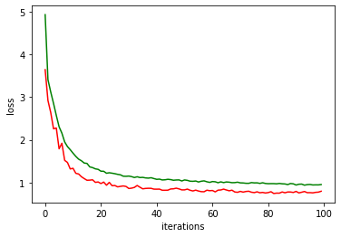

# MTA-Deep-Learning-Course_Paint-The-Circles
Final Project for Deep Learning Course of MTA using Convolutional Neural Networks (CNN) over PyTorch

# paint_the_circle Project

This project identifies and paints circles given in RGB images. Specifically, each input image contains a rectangle, a triangle and a circle. The image is fed into a neural netork, whose outputs are the center and radius of the circle within the image. The domain considered is "[0,1]x[0,1] "box". PyTorch is the platform used. The goal is to paint the circle.

### **You are given the following files:**
  Three directories named "train", "validation", and "test" each containing the following:
  1. a directory called "images" with RGB png files of size 128x128 (so image that is read has shape (3,128,128))
  2. a file "labels.txt" containing the center points (as x,y) and radius of the circles for all images in "images" directory

Since this problem is somewhat open ended, you are given a suggested structure and some functionality that is already implemented for you (see below). You are not at all obigated to follow this structure or use the code given. 

**Note:** 
- "network" and "model" are used interchangeably throughout this documentation.
 
 
### **General structure (in order):**
 1. DataSet and DataLoader            - this is how you load data into the network **(given to you)**
 2. Neural Network definition         - the class that defines your model   **(need to implement)**
 3. calculate model parameters number - useful to get a feel for network's size **(given to you)**
 4. loss function definition          - to be used in training **(need to implement)**
 5. create an optimizer               - choose your optimizer **(need to implement)**
 6. estimate number of ops per forward feed - the bigger this is the slower the training **(given to you)**
 7. estimate ops per forward feed     - use function given to you to estimate this **(implement for convenience)**
 8. view images and target and net labels - example code to help you see how to use loaders **(given to you)**
 9. validate_model                   - returns avg loss per image for a model and loader  **(need to implement)**
 10. train_model                      - trains the network **(need to implement)**
 11. plot train/validaion losses      - visualizing train and validation losses from training **(given to you)**
 12. save/load model                  - Allows you to save and load model to disk for later use **(given to you)**
 13. visualizing images    - Painting circles prodiced by network on images from a given loader **(given to you)**
 
 
### ** What you need to do **
You have 5 (and a half...) things to do:
 1. Create a CircleNet class, which is your network model. This is a key component. The output of your model should be 3 numbers that represent the the center and radius of the circle in the input image fed into your network. You should keep in mind the number of parameters in your model. If there are too many, it may overfit (and take longer to run). If there are too few, you it may not be able to learn the task needed. A typical structure would have convolutional layers first and fully connected at the end, thus reducing number of parameteres. Consider which activation function you want to use, and whether or not you wish to use batch normalization or dropout. Pooling layers are also possible. Be creative.
 
 2. Create a loss function. This is another key component as it defines what it means for two circles (the true circle and its estimation) to be similar or not. Namely, two circles (represented by two centers and two radii: ground truth ("labels") and network outputs ("outputs")), whose images look similar should have a smaller loss than two circles whose images look less simialr. Think about how you would quantify "closeness"/"similarity" of circles.

 3. Choose an optimizer. Look here for some ideas: https://pytorch.org/docs/master/optim.html
 
 4. (This is the "half" thing to do). For your conveinece you may want to use the function calc_ops() that is given to you to calculate an estimate of the number of operations that your network does per feed forward. To do this, you need to enter your own network structure. An example of an arbitrary network is privided to you.
 
 5. Create a validate_model function that assesses (tests) the performance of a model. It returns the average loss per image for a given loader. It can be run on any set of data (train, validation, or test). You may want to run this function on validation set (loader) from within the train function (see below) train after each epoch so as to see how loss behaves on validation during the training process.
 
 6. Create a train_model function that trains model. This function updates the following parameteres: model, train_losses, and validation_losses. Model is updated simply by the training processes when optimzer.step() is called. The other two parameteres are lists that hold the average loss per image for the corresponding data (train or validation). After every epoch (i.e., iteration that goes over the entire train data), you should save to these lists the average loss per image for the corresponding data loader. These lists are useful in that you can plot them (functionality given to you) and observe how model behaves. Observe: this fucnton returs nothing, however, it updates parameteres by reference. Specifically, model is updated (trained), and so are train and validation losses values.
 
**Note:** You are given three sets of data: trian, validation, and test. It is recommended that test not be touched until the very end, and validation be used to get a sense of your network's performance. 

### ** Running on a GPU: **
It is not necessary to use a GPU for this project. However, if you choose to do so, you will gain a major speedup to your training, which will save you much time. The code given to you identifies the hardware used and will  automatically run on either a GPU or CPU. 

### ** Useful links: **
1. PyTorch master tutorial - VERY useful: https://pytorch.org/docs/master/nn.html
2. PyTorch optimizers: https://pytorch.org/docs/master/optim.html
3. A list of possible reasons why things go wrong: https://blog.slavv.com/37-reasons-why-your-neural-network-is-not-working-4020854bd607#74de

### ** Final tips: **
Use the Internet! Things will not work first time. You will get strange error messages. Google them up. The web is  great resource for tackling problems ranging from python error messages, to things not doing what you'd like them to do.


### ** Submission Instructions**
The project is to be submittd in teams as in the homework. You need to submit the following three files:
1. model.dat                            - This is your saved model 
2. paint_that_circle.ipynb              - This is this notebook containing all of your work
3. model.py                             - A file containing your CircleNet class only. 

Before you submit, run "check_before_submission.ipynb" to make sure your model could be properly tested. See instructions for running this notebook inside.

Make sure your names appear at the top of this notebook in the appropriate place.

### **GOOD LUCK!**


```python
import numpy as np
import PIL.Image as Image
from PIL import ImageDraw


import torch.nn as nn
import math
import torch.nn.functional as F
import torch
from torch.utils.data import Dataset, DataLoader
import torch.optim as optim
import os
import glob
import datetime

# Device configuration
device = torch.device('cuda:0' if torch.cuda.is_available() else 'cpu')
```

# Dataset class definition


```python
class ShapesDataset(Dataset):
    
    def __init__(self, dataset_dir):
        """
        Initializing dataset by generating a dicitonary of labels, where an image file name is the key 
        and its labels are the contents of that entry in the dictionary. Images are not loaded. This way it
        is possible to iterate over arbitrarily large datasets (limited by labels dicitonary fitting 
        in memory, which is not a problem in practice)
        
        Args:
            dataset_dir : path to directory with images and labels. In this directory we expect to find
                          a directory called "images" containing the input images, and a file called 
                          "labels.txt" containing desired labels (coefficients)
        """
        
        self.dataset_dir = dataset_dir
        self.labels_dict = self.gen_labels_dict()
        self.images_keys = list(self.labels_dict)  # getting the keys of the dictionary as list
        self.images_keys.sort()                    # sorting so as to have in alphabetical order 

    def __len__(self):
        return len(self.labels_dict)

    def __getitem__(self, index):    
        """
        This funtion makes it possible to iterate over the ShapesDataset
        Args:
            index: running index of images
            
        Returns:
            sample: a dicitionary with three entries:
                    1. 'image'  contains the image
                    2. 'labels' contains labels (coeffs) corresponding to image
                    3. 'fname'  contains name of file (image_key) - may be useful for debugging
        """
        image_key = self.images_keys[index]     # recall - key is the file name of the corresponding image
        image = np.array(Image.open(image_key)) # image has shape: (128, 128, 3)
        image = image/255.0                     # simple normalization - just to maintain small numbers
        image = np.transpose(image, (2, 0, 1))  # network needs RGB channels to be first index
        labels = self.labels_dict[image_key]
        sample = {'image': image, 'labels': labels, 'fname':image_key}
        
        return sample
    
    
    def gen_labels_dict(self):
        """
        This fucntion generates a dictionary of labels
        
        Returns:
            labels_dict: the key is image file name and the value is the corresponding 
            array of labels  
        """
        
        labels_fname = self.dataset_dir + "/labels.txt"
        labels_dict = {}
        with open(labels_fname, "r") as inp:
            for line in inp:
                line = line.split('\n')[0]                                      # remove '\n' from end of line 
                line = line.split(',')
                key  = self.dataset_dir + '/images/' + line[0].strip() + ".png" # image file name is the key
                del line[0]
                
                list_from_line = [float(item) for item in line]
                labels_dict[key] = np.asarray(list_from_line, dtype=np.float32)
                        
        return labels_dict             

```

# Create Data Loaders


```python
train_dir      = "./train/"
validation_dir = "./validation/"
test_dir       = "./test/"


train_dataset = ShapesDataset(train_dir)

train_loader = DataLoader(train_dataset, 
                          batch_size=32,
                          shuffle=True)


validation_dataset = ShapesDataset(validation_dir)

validation_loader = DataLoader(validation_dataset, 
                               batch_size=1,
                               shuffle=False)


test_dataset = ShapesDataset(test_dir)

test_loader = DataLoader(test_dataset, 
                          batch_size=1,
                          shuffle=False)


print("train loader examples     :", len(train_dataset)) 
print("validation loader examples:", len(validation_dataset))
print("test loader examples      :", len(test_dataset))
```

    train loader examples     : 1000
    validation loader examples: 100
    test loader examples      : 100
    

# Neural Network class definition


```python
class CircleNet(nn.Module):    # nn.Module is parent class  
    def __init__(self):
        super(CircleNet, self).__init__()
        
        self.features = nn.Sequential(
            nn.BatchNorm2d(3),
            nn.Conv2d(3, 8, 5),
            nn.ReLU(inplace=True),
            nn.Conv2d(8, 8, 5),
            nn.ReLU(inplace=True),
            nn.MaxPool2d(2,2),
            nn.Conv2d(8, 16, 5),
            nn.ReLU(inplace=True),
            nn.MaxPool2d(2,2),
            nn.Conv2d(16, 16, 5),
            nn.ReLU(inplace=True),
            nn.MaxPool2d(2,2))

        self.features.apply(self.init_weights)
        
        self.classifier = nn.Sequential(
            nn.Dropout(),
            nn.Linear(16*12*12, 120),
            nn.ReLU(inplace=True),
            nn.Dropout(),
            nn.Linear(120, 84),
            nn.ReLU(inplace=True),
            nn.Linear(84, 3))
        
        self.classifier.apply(self.init_weights)
        
    def init_weights(self,m):
        if type(m) == nn.Conv2d:
            nn.init.xavier_uniform_(m.weight)
        elif type(m) == nn.Linear:
            nn.init.xavier_uniform_(m.weight)
        elif type(m) == nn.BatchNorm2d:
            nn.init.normal_(m.weight.data, 1.0, 0.02)
            nn.init.constant_(m.bias.data, 0.0) 
            

    def forward(self, x):
        x = self.features(x)
        x = x.view(x.size(0), -1)
        x = torch.flatten(x,1)
        x = self.classifier(x)
        return x
             
   
```

# Loss function definition


```python
def my_loss(outputs, labels):
    
    """
    Args:
        outputs - output of network ([batch size, 3]) 
        labels  - desired labels  ([batch size, 3])
    """
    
    loss = torch.zeros(1, dtype=torch.float, requires_grad=True)
    loss = loss.to(device)
    
    #----------------------------------------------
    # implementation needed here 
    batchsize = outputs.shape[0]
    accuracy = 0
    for i in range(batchsize):
        x1,y1,r1 = outputs[i]
        x2,y2,r2 = labels[i]
        dist = (((((12*(x1 - x2))**2) + ((12*(y1 - y2))**2) + (10*(r1-r2))**2)**(0.5))) 
        if dist >= 0.01:
            dist = dist + 0.5
        loss =  loss + dist
    loss = loss / batchsize
    #----------------------------------------------
    
                                      
    return loss

```

# Get number of trainable parameters


```python
def get_train_params_num(model):
    """
    This fucntion returns the number of trainable parameters of neural network model
    You may want to call it after you create your model to see how many parameteres the model has
    Args:
        model - neural net to examine
    """
    
    #filter given iterable with a function that tests each element in the iterable to be true or not
    model_parameters = filter(lambda p: p.requires_grad == True, model.parameters()) 
    params_num = sum([np.prod(p.size()) for p in model_parameters])
    return params_num

```

# Model creation and choice of optimizer


```python
model = CircleNet().to(device)
print ("Number of model trainable parameters:", get_train_params_num(model))

#----------------------------------------------
#  Choose your optimizer:
#  implementation needed here 
optimizer = torch.optim.Adam(model.parameters(), lr=0.0009)
#----------------------------------------------


```

    Number of model trainable parameters: 298873
    

# Get an estimate number of operations


```python
def calc_ops(inp_size, net_struct):
    """
    Calculates a rough number of operations for a given network topology
    Args:
        inp_size - (W,H) of input 
        net_struct - list of tuples describing structure of network. 
        
        Example:
         (('conv2d', (3, 8, 3, 1, 0)),  # cin, cout, kernel, stride, pad
          ('conv2d': 83, 8, 3, 1, 0)),
          ('MaxPool2d', (2,2)),         # kernel, stride
          ('fc': (64, 8)),      
          ('fc': (8, 4)))
         
    """
    
    ops = 0
    W, H = inp_size
    for curr_item in net_struct:
        if curr_item[0] == 'conv2d':
            cin = curr_item[1][0]
            cout = curr_item[1][1]
            kernel = curr_item[1][2]
            stride = curr_item[1][3]
            pad = curr_item[1][4]
            W = (W +2*pad - kernel)/stride + 1
            H = (H +2*pad - kernel)/stride + 1
            curr_ops = (W*H*cin*cout*kernel*kernel)/stride
            ops += curr_ops
            print (curr_item, ":",  "{:,}".format(int(curr_ops)))
        elif curr_item[0] == 'MaxPool2d':
            kernel = curr_item[1][0]
            stride = curr_item[1][1]
            W = (W - kernel)/stride + 1
            H = (H - kernel)/stride + 1
        else:
            curr_ops = curr_item[1][0] * curr_item[1][1]
            ops += curr_ops
            print (curr_item, ":",  "{:,}".format(int(curr_ops)))
            
    return int(ops)
```

# Check rough number of ops for network


```python
inp_size = (128,128)

# place your network ropology in example_net below to obtain an estimated number of operations for your network
example_net = (('conv2d', (3,8,5,1,0)),
               ('conv2d', (8, 8, 5,1,0)),
               ('MaxPool2d', (2,2)),
               ('conv2d', (8, 16, 5, 1, 0)),
               ('MaxPool2d', (2,2)),
               ('conv2d', (16, 16, 5, 1, 0)),
               ('MaxPool2d', (2,2)),
               ('fc', (16*12*212, 120)),
               ('fc', (120,84)),
               ('fc', (84, 3)))

ops = calc_ops(inp_size, example_net)
print()
print("Total ops: {:,}".format(ops))
```

    ('conv2d', (3, 8, 5, 1, 0)) : 9,225,600
    ('conv2d', (8, 8, 5, 1, 0)) : 23,040,000
    ('conv2d', (8, 16, 5, 1, 0)) : 10,035,200
    ('conv2d', (16, 16, 5, 1, 0)) : 3,686,400
    ('fc', (40704, 120)) : 4,884,480
    ('fc', (120, 84)) : 10,080
    ('fc', (84, 3)) : 252
    
    Total ops: 50,882,012
    

# View images, target circle labels and  network outputs


```python
"""
View first image of a given number of batches assuming that model has been created. 
Currently, lines assuming model has been creatd, are commented out. Without a model, 
you can view target labels and the corresponding images.
This is given to you so that you may see how loaders and model can be used. 
"""

loader = train_loader # choose from which loader to show images
bacthes_to_show = 2
with torch.no_grad():
    for i, data in enumerate(loader, 0): #0 means that counting starts at zero
        inputs = (data['image']).to(device)   # has shape (batch_size, 3, 128, 128)
        labels = (data['labels']).to(device)  # has shape (batch_size, 3)
        img_fnames = data['fname']            # list of length batch_size
        
        #outputs = model(inputs.float())
        img = Image.open(img_fnames[0])
        
        print ("showing image: ", img_fnames[0])
        
        labels_str = [ float(("{0:.2f}".format(x))) for x in labels[0]]#labels_np_arr]
        
        #outputs_np_arr = outputs[0] # using ".numpy()" to convert tensor to numpy array
        #outputs_str = [ float(("{0:.2f}".format(x))) for x in outputs_np_arr]
        print("Target labels :", labels_str )
        #print("network coeffs:", outputs_str)
        print()
        #img.show()
        
        if (i+1) == bacthes_to_show:
            break
        
```

    showing image:  ./train//images/0436.png
    Target labels : [0.42, 0.35, 0.21]
    
    showing image:  ./train//images/0378.png
    Target labels : [0.28, 0.25, 0.2]
    
    

# Validate model function


```python
def validate_model(model, loader):
    """
    This function parses a given loader and returns the avergae (per image) loss 
    (as defined by "my_loss") of the entire dataset associated with the given loader.
    
    Args:
        model  - neural network to examine
        loader - where input data comes from (train, validation, or test)
        
    returns:
        average loss per image in variable named "avg_loss"
    """

    model.eval()  # eval mode (batchnorm uses moving mean/variance instead of mini-batch mean/variance)
                  # (dropout is set to zero)

    #----------------------------------------------
    # implementation needed here 
    avg_loss = 0 
    model.float()
    with torch.no_grad():
        for batch_idx, source in enumerate(loader):
                source, target = source['image'], source['labels']
                source, target = source.to(device), target.to(device)
                output = model(source.float())
                loss = my_loss(output, target)
                avg_loss = avg_loss + loss.item() * source.size(0)
        avg_loss = avg_loss / len(loader.dataset)
    #----------------------------------------------
    

    model.train()
    return avg_loss

```

# train model function


```python
def train_model(model,
                optimizer,
                train_loader,
                validation_loader,
                train_losses,
                validation_losses,
                epochs=1):
    
    """
    Trains a neural network. 
    Args:
        model               - model to be trained
        optimizer           - optimizer used for training
        train_loader        - loader from which data for training comes 
        validation_loader   - loader from which data for validation comes (maybe at the end, you use test_loader)
        train_losses        - adding train loss value to this list for future analysis
        validation_losses   - adding validation loss value to this list for future analysis
        epochs              - number of runs over the entire data set 
    """
    
    #----------------------------------------------
    # implementation needed here 
    model.train()
    model.float()
    for ep in range(epochs):
        train_loss = 0
        valid_loss = 0
        for batch_idx, source in enumerate(train_loader):
            source, target = source['image'], source['labels']
            source, target = source.to(device), target.to(device)
            optimizer.zero_grad()
            output = model(source.float())
            batch_loss = my_loss(output, target)
            batch_loss.backward()
            optimizer.step()
            train_loss = train_loss + batch_loss.item() * source.size(0)
            
        valid_loss = validate_model(model,validation_loader)
        
        train_losses.append(train_loss / len(train_loader.dataset))
        validation_losses.append(valid_loss)
        
        print("Train Epoch: %d \tLoss: %.6f " % (
            ep + 1, train_loss / len(train_loader.dataset)))
    #----------------------------------------------
    
 
    return 
    

```

# Actual train


```python
# Using two lists (train_losses, validation_losses) containing history of losses 
# (i.e., loss for each training epoch) for train and validation sets. 
# If thess are not defined, we define them. Otherwise, the function train_model
# updates these two lists (by adding loss values when it is called for further training) 
# in order to be able to visualize train and validation losses


if not 'train_losses' in vars():
    train_losses = []
if not 'validation_losses' in vars():
    validation_losses = []


train_model(model, 
            optimizer,
            train_loader, 
            validation_loader, 
            train_losses, 
            validation_losses,
            epochs=100)

```

    Train Epoch: 1 	Loss: 4.925345 
    Train Epoch: 2 	Loss: 3.407535 
    Train Epoch: 3 	Loss: 3.117924 
    Train Epoch: 4 	Loss: 2.852358 
    Train Epoch: 5 	Loss: 2.569990 
    Train Epoch: 6 	Loss: 2.304269 
    Train Epoch: 7 	Loss: 2.156237 
    Train Epoch: 8 	Loss: 1.950284 
    Train Epoch: 9 	Loss: 1.841644 
    Train Epoch: 10 	Loss: 1.768687 
    Train Epoch: 11 	Loss: 1.687524 
    Train Epoch: 12 	Loss: 1.612514 
    Train Epoch: 13 	Loss: 1.548086 
    Train Epoch: 14 	Loss: 1.510174 
    Train Epoch: 15 	Loss: 1.457175 
    Train Epoch: 16 	Loss: 1.448306 
    Train Epoch: 17 	Loss: 1.366923 
    Train Epoch: 18 	Loss: 1.350235 
    Train Epoch: 19 	Loss: 1.321050 
    Train Epoch: 20 	Loss: 1.309368 
    Train Epoch: 21 	Loss: 1.266413 
    Train Epoch: 22 	Loss: 1.264455 
    Train Epoch: 23 	Loss: 1.218512 
    Train Epoch: 24 	Loss: 1.229853 
    Train Epoch: 25 	Loss: 1.219652 
    Train Epoch: 26 	Loss: 1.207772 
    Train Epoch: 27 	Loss: 1.192686 
    Train Epoch: 28 	Loss: 1.181806 
    Train Epoch: 29 	Loss: 1.149419 
    Train Epoch: 30 	Loss: 1.147000 
    Train Epoch: 31 	Loss: 1.152457 
    Train Epoch: 32 	Loss: 1.139332 
    Train Epoch: 33 	Loss: 1.118473 
    Train Epoch: 34 	Loss: 1.135956 
    Train Epoch: 35 	Loss: 1.117814 
    Train Epoch: 36 	Loss: 1.121724 
    Train Epoch: 37 	Loss: 1.109282 
    Train Epoch: 38 	Loss: 1.104030 
    Train Epoch: 39 	Loss: 1.113497 
    Train Epoch: 40 	Loss: 1.094082 
    Train Epoch: 41 	Loss: 1.076276 
    Train Epoch: 42 	Loss: 1.081095 
    Train Epoch: 43 	Loss: 1.061606 
    Train Epoch: 44 	Loss: 1.065620 
    Train Epoch: 45 	Loss: 1.077163 
    Train Epoch: 46 	Loss: 1.070033 
    Train Epoch: 47 	Loss: 1.054625 
    Train Epoch: 48 	Loss: 1.060787 
    Train Epoch: 49 	Loss: 1.062802 
    Train Epoch: 50 	Loss: 1.038094 
    Train Epoch: 51 	Loss: 1.061670 
    Train Epoch: 52 	Loss: 1.052299 
    Train Epoch: 53 	Loss: 1.032442 
    Train Epoch: 54 	Loss: 1.029944 
    Train Epoch: 55 	Loss: 1.037161 
    Train Epoch: 56 	Loss: 1.014052 
    Train Epoch: 57 	Loss: 1.032069 
    Train Epoch: 58 	Loss: 1.040544 
    Train Epoch: 59 	Loss: 1.019306 
    Train Epoch: 60 	Loss: 1.005029 
    Train Epoch: 61 	Loss: 1.024356 
    Train Epoch: 62 	Loss: 1.019105 
    Train Epoch: 63 	Loss: 0.996797 
    Train Epoch: 64 	Loss: 1.017092 
    Train Epoch: 65 	Loss: 0.999739 
    Train Epoch: 66 	Loss: 1.014415 
    Train Epoch: 67 	Loss: 1.009426 
    Train Epoch: 68 	Loss: 0.997926 
    Train Epoch: 69 	Loss: 0.999546 
    Train Epoch: 70 	Loss: 1.009349 
    Train Epoch: 71 	Loss: 0.993148 
    Train Epoch: 72 	Loss: 0.991208 
    Train Epoch: 73 	Loss: 0.983483 
    Train Epoch: 74 	Loss: 0.982576 
    Train Epoch: 75 	Loss: 0.999934 
    Train Epoch: 76 	Loss: 0.992406 
    Train Epoch: 77 	Loss: 0.993809 
    Train Epoch: 78 	Loss: 0.981127 
    Train Epoch: 79 	Loss: 0.995536 
    Train Epoch: 80 	Loss: 0.979528 
    Train Epoch: 81 	Loss: 0.973962 
    Train Epoch: 82 	Loss: 0.975754 
    Train Epoch: 83 	Loss: 0.975491 
    Train Epoch: 84 	Loss: 0.970787 
    Train Epoch: 85 	Loss: 0.980000 
    Train Epoch: 86 	Loss: 0.971209 
    Train Epoch: 87 	Loss: 0.967809 
    Train Epoch: 88 	Loss: 0.953389 
    Train Epoch: 89 	Loss: 0.978035 
    Train Epoch: 90 	Loss: 0.970912 
    Train Epoch: 91 	Loss: 0.942748 
    Train Epoch: 92 	Loss: 0.961497 
    Train Epoch: 93 	Loss: 0.964853 
    Train Epoch: 94 	Loss: 0.939337 
    Train Epoch: 95 	Loss: 0.951990 
    Train Epoch: 96 	Loss: 0.955890 
    Train Epoch: 97 	Loss: 0.944566 
    Train Epoch: 98 	Loss: 0.946532 
    Train Epoch: 99 	Loss: 0.945999 
    Train Epoch: 100 	Loss: 0.953896 
    

# Plot losses from training process (given to you)


```python
import matplotlib.pyplot as plt


iteration = np.arange(0., len(train_losses))
plt.plot(iteration, train_losses, 'g-', iteration, validation_losses, 'r-')
plt.xlabel('iterations')
plt.ylabel('loss')
plt.show()
    

```





# Save/Load Model (given to you)


```python
def save(model, train_losses, validation_losses, save_dir):
    """
    saving model, train losses, and validation losses
    Args:
        model              - NN to be saved
        train_losses       - history of losses for training dataset
        validation_losses  - history of losses for validation dataset
        save_dir           - directory where to save the above
    """
    
    if not os.path.exists(save_dir):
        os.makedirs(save_dir)
    files = glob.glob(save_dir + '*')
    for f in files:
        os.remove(f) 
    
    
    torch.save(model, save_dir + "/model.dat")
    
    train_losses_f = open(save_dir + "/train_losses.txt", "wt")
    train_losses_f.writelines( "%.3f\n" % item for item in train_losses)
    
    validation_losses_f = open(save_dir + "/validation_losses.txt", "wt")
    validation_losses_f.writelines( "%.3f\n" % item for item in validation_losses)

    return
   

def load(save_dir):
    """
    loading model, train losses, and validation losses
    Args:
       save_dir  - dir name from where to load 
    """
    
    model = torch.load(save_dir + "/model.dat") 
    
    train_losses_f = open(save_dir + "/train_losses.txt", "rt")
    train_losses   = train_losses_f.readlines()
    train_losses   = [float(num) for num in train_losses]
    
    validation_losses_f = open(save_dir + "/validation_losses.txt", "rt")
    validation_losses   = validation_losses_f.readlines()
    validation_losses   = [float(num) for num in validation_losses]
    
    return (model, train_losses, validation_losses)
   
```

# Example saving and loading


```python
# Create a directory, for example "./saves_12/", where you place your saved models

save(model, train_losses, validation_losses, "./saves/")

model, train_losses, validation_losses = load("./saves/")
```

# Paint circles on loader images


```python
def paint_loader_circles(model, loader, out_dir):
    """
    This fucntion receives a model, a loader and an output directory. 
    For each image in the loader it paints a circle that the model identifies. 
    The images are saved in the given out_dir diretory. 
    Args:
        model   - network for idneitfying circles
        loader  - input data to use 
        out_dir - ouptut directory name (e.g.: 'draws/'). If directory does not exist, it is created.
                  If it exists, its files are deleted.
    """

    model.eval()  # eval mode (batchnorm uses moving mean/variance instead of mini-batch mean/variance)
                  # (dropout is set to zero)

    k = 0
    
    if not os.path.exists(out_dir):
        os.makedirs(out_dir)
    files = glob.glob(out_dir + '*')
    for f in files:
        os.remove(f) 
  
        
    for data in loader:
        # get inputs
        inputs = (data['image']).to(device)
        labels = (data['labels']).to(device)  # not using 
        img_fnames = data['fname'] 
      
        
        # forward
        outputs = model(inputs.float())
        curr_batch_size = np.shape(outputs)[0]
        image_size = np.shape(inputs[0])  # image_size = [3, w, h]
        _, width, height = image_size
        assert (width == height)
        
        for i in range (curr_batch_size): 
            x0 = (outputs[i, 0].item()) * width
            y0 = (1-outputs[i, 1].item()) * height
            r  = outputs[i, 2].item() * width #assume width=height here. Otherwise, circle becomes ellipse
   
            fname = img_fnames[i]
            k+=1
            print (str(k) + ".   " + fname)

            img = Image.open(fname)
            draw = ImageDraw.Draw(img, 'RGBA')
    
            draw.ellipse((x0 - r, y0 - r, x0 + r ,y0 + r), fill=(160, 64, 0, 90), outline=None)
    
            img.save(out_dir + fname.split('/')[-1])
    
        
    model.train()  #back to default
    return
```

# Example of how to paint circles produced by model


```python
# Painting circles on images from validation loader and placing them in directory "./validation/draw/". 
# Notice that if the painted circle is seen only partly, it means that it is not inside the 
# [0,1]x[0,1] "box", which is the domain considered.  This means that your model has siginificant error


paint_loader_circles(model, validation_loader, './validation/draw/')
```

    1.   ./test//images/0000.png
    2.   ./test//images/0001.png
    3.   ./test//images/0002.png
    4.   ./test//images/0003.png
    5.   ./test//images/0004.png
    6.   ./test//images/0005.png
    7.   ./test//images/0006.png
    8.   ./test//images/0007.png
    9.   ./test//images/0008.png
    10.   ./test//images/0009.png
    11.   ./test//images/0010.png
    12.   ./test//images/0011.png
    13.   ./test//images/0012.png
    14.   ./test//images/0013.png
    15.   ./test//images/0014.png
    16.   ./test//images/0015.png
    17.   ./test//images/0016.png
    18.   ./test//images/0017.png
    19.   ./test//images/0018.png
    20.   ./test//images/0019.png
    21.   ./test//images/0020.png
    22.   ./test//images/0021.png
    23.   ./test//images/0022.png
    24.   ./test//images/0023.png
    25.   ./test//images/0024.png
    26.   ./test//images/0025.png
    27.   ./test//images/0026.png
    28.   ./test//images/0027.png
    29.   ./test//images/0028.png
    30.   ./test//images/0029.png
    31.   ./test//images/0030.png
    32.   ./test//images/0031.png
    33.   ./test//images/0032.png
    34.   ./test//images/0033.png
    35.   ./test//images/0034.png
    36.   ./test//images/0035.png
    37.   ./test//images/0036.png
    38.   ./test//images/0037.png
    39.   ./test//images/0038.png
    40.   ./test//images/0039.png
    41.   ./test//images/0040.png
    42.   ./test//images/0041.png
    43.   ./test//images/0042.png
    44.   ./test//images/0043.png
    45.   ./test//images/0044.png
    46.   ./test//images/0045.png
    47.   ./test//images/0046.png
    48.   ./test//images/0047.png
    49.   ./test//images/0048.png
    50.   ./test//images/0049.png
    51.   ./test//images/0050.png
    52.   ./test//images/0051.png
    53.   ./test//images/0052.png
    54.   ./test//images/0053.png
    55.   ./test//images/0054.png
    56.   ./test//images/0055.png
    57.   ./test//images/0056.png
    58.   ./test//images/0057.png
    59.   ./test//images/0058.png
    60.   ./test//images/0059.png
    61.   ./test//images/0060.png
    62.   ./test//images/0061.png
    63.   ./test//images/0062.png
    64.   ./test//images/0063.png
    65.   ./test//images/0064.png
    66.   ./test//images/0065.png
    67.   ./test//images/0066.png
    68.   ./test//images/0067.png
    69.   ./test//images/0068.png
    70.   ./test//images/0069.png
    71.   ./test//images/0070.png
    72.   ./test//images/0071.png
    73.   ./test//images/0072.png
    74.   ./test//images/0073.png
    75.   ./test//images/0074.png
    76.   ./test//images/0075.png
    77.   ./test//images/0076.png
    78.   ./test//images/0077.png
    79.   ./test//images/0078.png
    80.   ./test//images/0079.png
    81.   ./test//images/0080.png
    82.   ./test//images/0081.png
    83.   ./test//images/0082.png
    84.   ./test//images/0083.png
    85.   ./test//images/0084.png
    86.   ./test//images/0085.png
    87.   ./test//images/0086.png
    88.   ./test//images/0087.png
    89.   ./test//images/0088.png
    90.   ./test//images/0089.png
    91.   ./test//images/0090.png
    92.   ./test//images/0091.png
    93.   ./test//images/0092.png
    94.   ./test//images/0093.png
    95.   ./test//images/0094.png
    96.   ./test//images/0095.png
    97.   ./test//images/0096.png
    98.   ./test//images/0097.png
    99.   ./test//images/0098.png
    100.   ./test//images/0099.png
    


```python

```
